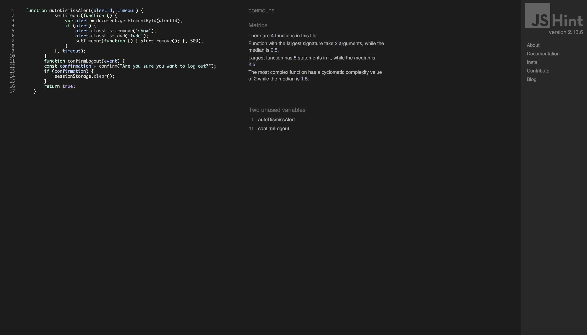

# Carblog


Carblog is a website designed for automotive enthusiasts who want to stay updated on the latest industry news, explore reviews of new car models, and share their own experiences and tips about vehicles. More than just a blog, Carblog addresses the need for centralized, relevant information for car lovers, offering an interactive and informative experience all in one place.
Carblog is ideal for those who:

   - Want to save time by finding all the latest automotive news and reviews in one space.
   - Are looking for a platform to share their opinions and tips with other enthusiasts.
   - Enjoy connecting with a community that shares the same passion for cars.
   - Need a tool to compare car models and make more informed purchasing decisions.
   - Seek inspiration for customizations or car maintenance through real stories and experiences from other users.

 ## Problems Solved by Carblog
  1. Information Fragmentation: Instead of searching for news, reviews, and personal experiences across multiple sources, users can find everything on Carblog.
  2. Difficulty in Making Purchase Decisions: With detailed reviews and the upcoming car comparison feature, Carblog helps users choose the ideal model based on their needs.
  3. Lack of an Interactive Community: Carblog encourages the exchange of ideas and experiences through posts, comments, and discussions.


### Wireframe Description

The wireframe below outlines the structure of the Carblog website, designed to provide a clear and intuitive user experience. Each section is strategically positioned to enhance navigation, content discovery, and user interaction.

1. **Header**:
   - The header contains three key areas:
     - **Brand (Logo)**: Positioned on the left to ensure instant recognition.
     - **Site Navigation Options**: Located centrally, providing links to main sections of the website.
     - **User Navigation Options**: Found on the right, offering access to user-specific features such as login, profile, or account settings.

2. **Page Introduction**:
   - Below the header, there's a dedicated space for the **Brand and Description of the Page**, which provides context about the website and its purpose.

3. **Main Content Area**:
   - This is the central focus of the page, divided into three parts:
     - **Image (img)**: A placeholder for visuals related to the post or topic being displayed.
     - **User-Supplied Content**: A section for displaying written or uploaded content provided by users.
     - **Details Button**: A call-to-action button for users to view more details about the post or content.

4. **Sidebar**:
   - Positioned on the right side, the sidebar contains links to **Categories**:
     - These links allow users to filter content based on their preferences, such as specific types of vehicles or topics of interest.

This wireframe ensures a clean and functional layout, optimized for readability, ease of navigation, and user engagement. It serves as a guide for developing the Carblog's visual and interactive structure.


## Features

### Existing Features

- **Navigation Bar**

  - Featured on all pages, the fully responsive navigation bar includes links to the home page, new posts, user informations. It is consistent across all pages to allow for easy and intuitive navigation.
  - This section enables users to seamlessly navigate from one page to another on all devices without needing to use the 'back' button.
  

- **Home Page**

  - Main page, shows posts according to creation date, categories and images.
  

- **New post page**

  - The create new post page allows the user to create their post with content, image and the category it fits into.
  

- **Categories**

  - Categories allow you to display content according to the user's preference
  

- **Read More**

  - By clicking on read more the user has more details about the post as well as being able to make comments and if it is a post created by themselves they can edit or delete the post.
  

- **User menu**

  - In the user menu you can see personal information, your posts and post management options.
  


### Features Left to Implement

- User feedback survey form
- Car comparison section

## Data Structure

The Carblog application uses a relational database to store and manage data. The database schema is designed to handle user accounts, blog posts, categories, and comments efficiently, ensuring scalability and data integrity.

### Database Models

1. **Category**
   - Represents categories to organize posts.
   - **Fields**:
     - `id` (Primary Key): Auto-incremented identifier for each category.
     - `name`: The name of the category (e.g., "Sports Cars", "SUVs").
   - **Methods**:
     - `__str__`: Returns the name of the category as its string representation.

2. **Post**
   - Represents individual blog posts created by users.
   - **Fields**:
     - `id` (Primary Key): Auto-incremented identifier for each post.
     - `title`: The title of the post.
     - `content`: The content of the post.
     - `author` (Foreign Key): Links the post to its creator (User model). If a user is deleted, their posts are also deleted.
     - `created_at`: The date and time the post was created (automatically set when the post is created).
     - `updated_at`: The date and time the post was last updated (automatically updated whenever the post is saved).
     - `approved`: A boolean indicating whether the post has been approved for publication.
     - `category` (Foreign Key): Links the post to a specific category. This field is optional.
     - `image`: An optional image associated with the post, stored in the `post_images/` directory.
     - `slug`: A unique slug for the post, generated from the title. If a slug already exists, a counter is appended to ensure uniqueness.
   - **Methods**:
     - `save`: Overrides the default save method to automatically generate a unique slug based on the title.

3. **Comment**
   - Represents comments made on blog posts.
   - **Fields**:
     - `id` (Primary Key): Auto-incremented identifier for each comment.
     - `post` (Foreign Key): Links the comment to a specific post. If the post is deleted, the associated comments are also deleted.
     - `author` (Foreign Key): Links the comment to its creator (User model). If a user is deleted, their comments are also deleted.
     - `content`: The content of the comment.
     - `created_at`: The date and time the comment was created (automatically set when the comment is created).
     - `approved`: A boolean indicating whether the comment has been approved for publication.
   - **Methods**:
     - `__str__`: Returns a string indicating the author and the post the comment is associated with.

### Relationships

- **User and Post**: One-to-Many relationship. A user can create multiple posts, but each post belongs to a single user.
- **Post and Category**: Many-to-One relationship. A post can belong to one category, but a category can have multiple posts.
- **Post and Comment**: One-to-Many relationship. A post can have multiple comments, but each comment belongs to one post.
- **User and Comment**: One-to-Many relationship. A user can write multiple comments, but each comment is linked to a single user.

### Security and Authorization

- **User Data Security**:
  - Passwords are encrypted using Django's default hashing mechanisms.
  - Sensitive data is protected by environment variables and not hard-coded in the application.
  
- **Authorization**:
  - Only authenticated users can create, edit, or delete their posts.
  - Users cannot edit or delete posts or comments created by others.
  - Only admins or moderators can approve or reject posts and comments.

---

## Testing

### Validator Testing

- HTML
  - No errors were found on the other pages, except the "logou/": [W3C validator](https://validator.w3.org)
    
  

- CSS
  - No errors were found when passing through the [Jigsaw validator](https://jigsaw.w3.org)
    

- JavaScript
    

### Check List

- A feature checklist was created to ensure all necessary tests.
  
| **Function**                | **Behavior**                               | **Pass/Fail** |
|-----------------------------|--------------------------------------------|---------------|
| **Load Page**               | Page loads with the correct layout         | pass         |
| **Title Display**           | Displays the correct title                 | pass         |
| **Content Display**         | Shows content based on the page type       | pass         |
| **Form Display**            | Form fields are correctly rendered         | pass         |
| **CSRF Token**              | CSRF token is present in forms             | pass         |
| **Submit Button**           | Submit button is visible and clickable     | pass         |
| **Validation Messages**     | Displays validation messages where required| pass         |
| **Success Messages**        | Shows success messages (e.g., on login, logout) | pass     |
| **Error Messages**          | Displays error messages (e.g., on failed login) | pass    |
| **Image Display**           | Displays images if available               | pass         |
| **Form Field Rendering**    | Form fields render correctly (e.g., text fields, dropdowns) | pass |
| **Link Navigation**         | Links navigate to the correct pages        | pass         |
| **Dynamic Content**         | Displays dynamic content (e.g., posts, comments) | pass     |
| **Button Functionality**    | Buttons perform their intended actions (e.g., save, cancel) | pass |
| **Logout Functionality**    | Successfully logs out and displays logout message | pass  |
| **Login Functionality**     | Login form submits correctly and shows login errors | pass  |
| **Password Reset**          | Handles password reset correctly (request, confirm, and success) | pass |
| **Page Responsiveness**     | Page is responsive and works on different screen sizes | pass |
| **User Authentication Check** | User-specific content is displayed correctly | pass    |
| **Comment Form**            | Comment form submits correctly for logged-in users | pass   |
| **Category Links**          | Category links filter posts correctly      | pass         |
| **Post Editing**            | Allows editing of posts and saves changes | pass          |
| **Post Deletion**           | Allows post deletion and confirms action  | pass          |
| **Registration**            | Allows new user registration and shows errors if needed | pass |
| **Admin Access**            | Admin-specific links and functionalities are accessible for superusers | pass |
| **Review Notice**           | Shows review notice when creating new posts | pass        |
| **Result Navigation**       | Navigates to results or summary pages appropriately | pass   |
| **Username Display**        | Displays username on relevant pages (e.g., profile) | pass    |
| **Form Field Styling**      | Form fields are styled correctly           | pass         |
| **Error Handling**          | Handles errors (e.g., form submission errors) gracefully | pass  |


## Automated Tests

This project includes automated tests for the main application models (`Category`, `Post`, and `Comment`). The tests are implemented using Django's built-in testing framework (`django.test`). Below is a detailed description of the tests:

---

### Test Structure

The tests are organized into three classes, each representing a specific model:

1. **CategoryModelTest**
2. **PostModelTest**
3. **CommentModelTest**

Each class uses the `setUp` method to create the necessary data for the tests, ensuring that each test is executed independently with a consistent data set.

---

## Included Tests

### 1. CategoryModelTest
- **Description**: Tests the `Category` model.
- **Tested Methods**:
  - `__str__`: Verifies that the string representation of a category is the name assigned to it.
- **Example**:
  - A category named "Technology" is created, and we verify that `str(category)` returns "Technology".

### 2. PostModelTest
- **Description**: Tests the `Post` model.
- **Tested Methods**:
  - Post creation and attribute verification (`title`, `content`, `author`, `category`).
  - The `approved` field, which should be `False` by default.
  - `__str__`: Verifies that the string representation of a post is its title.
- **Example**:
  - A post with the title "Django Testing" is created, and we verify the attributes and the output of `str(post)`.

### 3. CommentModelTest
- **Description**: Tests the `Comment` model.
- **Tested Methods**:
  - Comment creation and attribute verification (`post`, `author`, `content`).
  - The `approved` field, which should be `False` by default.
  - `__str__`: Verifies that the string representation of a comment follows the expected format (`"Comment by <author> on <post>"`).
- **Example**:
  - A comment is created on a post, and we verify the attributes and the output of `str(comment)`.

---

## How to Run the Tests

To run the tests, use the following command in the terminal:

```bash
python manage.py test
```
### Lighthouse Tests

- Lighthouse tests were conducted on all pages to ensure performance.

    
  

## Deployment

The deployment process ensures that the Car Blog application is live and accessible to users. Below is a step-by-step guide with detailed explanations for deploying the application using Heroku:

1. **Clone the Repository**  
   Clone the project repositories to your local environment or GitHub account.

2. **Install Heroku CLI**  
   Download and install the Heroku CLI.
   After installation, log in using:

   ```bash
    heroku login
    ```
   on your terminal.

   This opens a browser window for authentication.

3. **Create a Heroku App**  
   On your Heroku dashboard, click the `New` button in the right corner and then `Create new app`.
   On the next page, add a name for your app and select the region you want.
   On the next page, navigate to the `Deploy` section and in the `Deployment method` option select `Github`, connect to your Github repository.

4. **Add Necessary Add-ons**  
    In the `Resources` tab on your Heroku app's dashboard, add the following `add ons` to the search field:

    - Heroku Postgres for the database.
    - Cloudinary for image storage.

5. **Configure Environment Variables**  

    In the Heroku dasbord, go to the `settings` tab and in the `Config Var` section add the following variable:

    - `ALLOWED_HOSTS`: Your app's domain.
    - `DATABASE_URL`: URL for the Postgres database.
    - `CLOUDINARY_URL`: Your Cloudinary API key.
    - `DEBUG` : value of False.
    - `SECRET_KEY`: Django secret key.
    - `EMAIL_HOST_USER`: the email that you want to use for reset password..
    - `EMAIL_HOST_PASSWORD`: your APP password.

6. **Perform Database Migrations**  
    On your environment access the Heroku terminal:

    ```bash
    heroku run bash -a your app name
    ```
    Replace "your app name" with the name of your app

    Run 
    ```bash
    python manage.py migrate
    ```
    in the Heroku terminal.

7. **Deploy the Application**  
   After this process, in the `Deploy` tab in the `Manual deploy` section, click on the `Deploy Branch` button to start the app.

8. **Access the Live Application**  
   The site will be live at the Heroku app URL.

---

The live link can be found here - [https://carblog-6763fde39b1c.herokuapp.com](https://carblog-6763fde39b1c.herokuapp.com)


### Content

- The textual content was sourced from the following:
  - [Edmunds](https://www.edmunds.com)
- The favicon was taken from [Favicon.io](https://favicon.io)

### Media

- The images used were sourced from [Pexels](https://www.pexels.com)