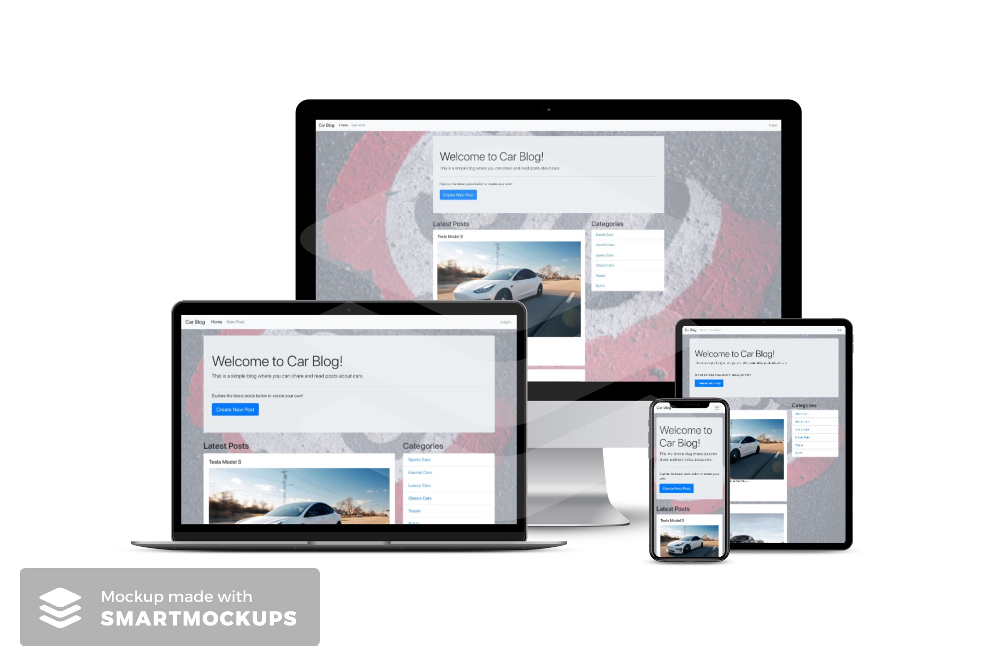
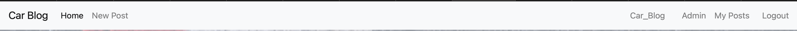
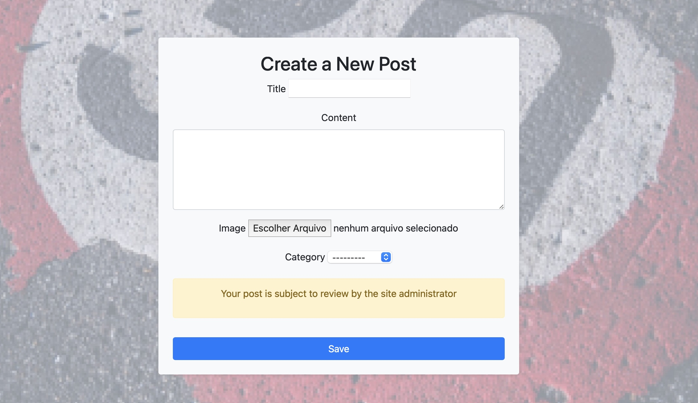
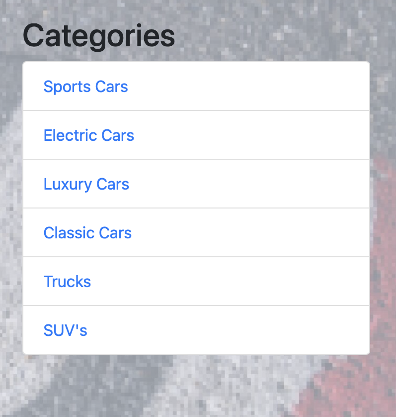
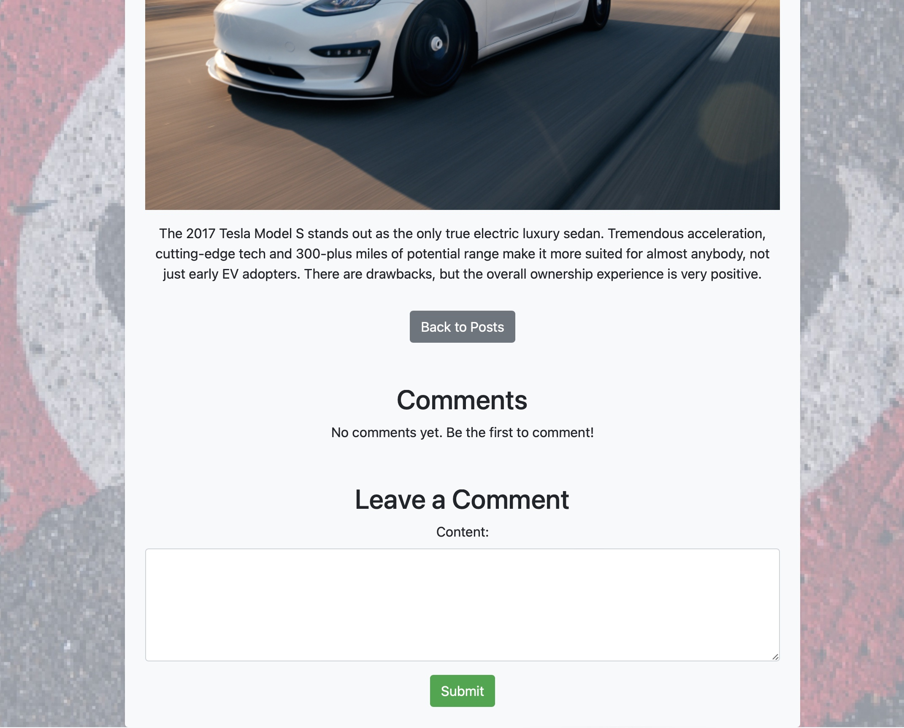
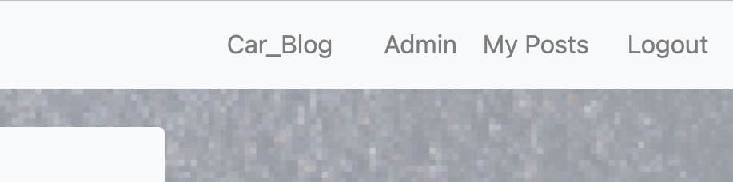
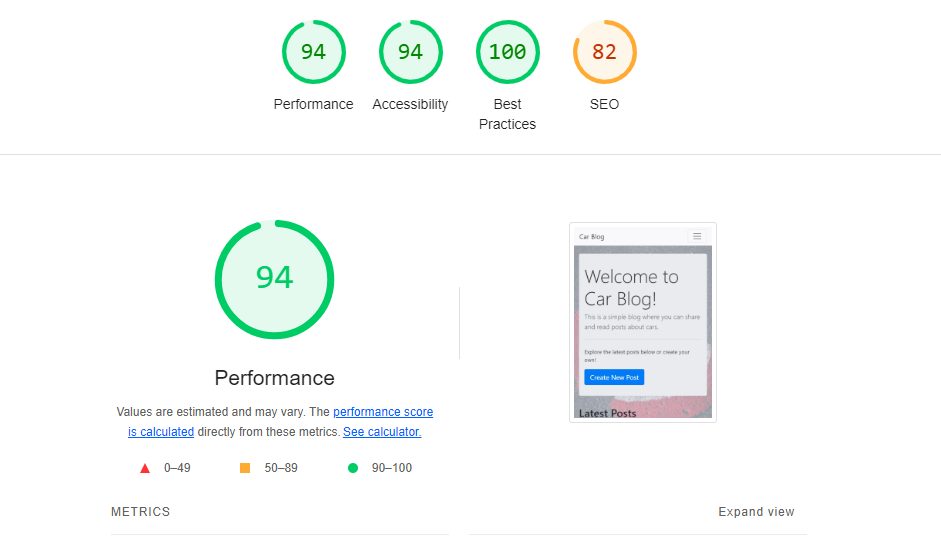

# Carblog

Carblog is a website dedicated to automotive enthusiasts who want to stay informed about the latest industry news, review new car models, and share their own experiences and tips about vehicles. The site is designed to provide an interactive and informative experience for all car lovers.

## Features

### Existing Features

- **Navigation Bar**

  - Featured on all pages, the fully responsive navigation bar includes links to the home page, new posts, user informations. It is consistent across all pages to allow for easy and intuitive navigation.
  - This section enables users to seamlessly navigate from one page to another on all devices without needing to use the 'back' button.
  

- **Home Page**

  - Main page, shows posts according to creation date, categories and images.
  

- **New post page**

  - The create new post page allows the user to create their post with content, image and the category it fits into.
  

- **Categories**

  - Categories allow you to display content according to the user's preference
  

- **Read More**

  - By clicking on read more the user has more details about the post as well as being able to make comments and if it is a post created by themselves they can edit or delete the post.
  

- **User menu**

  - In the user menu you can see personal information, your posts and post management options.
  

### Features Left to Implement

- User feedback survey form
- Car comparison section

## Testing

### Validator Testing

- HTML
  - No errors were returned when passing through the [W3C validator](https://validator.w3.org)
    
  

- CSS
  - No errors were found when passing through the [Jigsaw validator](https://jigsaw.w3.org)
    

### Check List

- A feature checklist was created to ensure all necessary tests.
  
| **Function**                | **Behavior**                               | **Pass/Fail** |
|-----------------------------|--------------------------------------------|---------------|
| **Load Page**               | Page loads with the correct layout         | pass         |
| **Title Display**           | Displays the correct title                 | pass         |
| **Content Display**         | Shows content based on the page type       | pass         |
| **Form Display**            | Form fields are correctly rendered         | pass         |
| **CSRF Token**              | CSRF token is present in forms             | pass         |
| **Submit Button**           | Submit button is visible and clickable     | pass         |
| **Validation Messages**     | Displays validation messages where required| pass         |
| **Success Messages**        | Shows success messages (e.g., on login, logout) | pass     |
| **Error Messages**          | Displays error messages (e.g., on failed login) | pass    |
| **Image Display**           | Displays images if available               | pass         |
| **Form Field Rendering**    | Form fields render correctly (e.g., text fields, dropdowns) | pass |
| **Link Navigation**         | Links navigate to the correct pages        | pass         |
| **Dynamic Content**         | Displays dynamic content (e.g., posts, comments) | pass     |
| **Button Functionality**    | Buttons perform their intended actions (e.g., save, cancel) | pass |
| **Logout Functionality**    | Successfully logs out and displays logout message | pass  |
| **Login Functionality**     | Login form submits correctly and shows login errors | pass  |
| **Password Reset**          | Handles password reset correctly (request, confirm, and success) | pass |
| **Page Responsiveness**     | Page is responsive and works on different screen sizes | pass |
| **User Authentication Check** | User-specific content is displayed correctly | pass    |
| **Comment Form**            | Comment form submits correctly for logged-in users | pass   |
| **Category Links**          | Category links filter posts correctly      | pass         |
| **Post Editing**            | Allows editing of posts and saves changes | pass          |
| **Post Deletion**           | Allows post deletion and confirms action  | pass          |
| **Registration**            | Allows new user registration and shows errors if needed | pass |
| **Admin Access**            | Admin-specific links and functionalities are accessible for superusers | pass |
| **Review Notice**           | Shows review notice when creating new posts | pass        |
| **Result Navigation**       | Navigates to results or summary pages appropriately | pass   |
| **Username Display**        | Displays username on relevant pages (e.g., profile) | pass    |
| **Form Field Styling**      | Form fields are styled correctly           | pass         |
| **Error Handling**          | Handles errors (e.g., form submission errors) gracefully | pass  |

### Lighthouse Tests

- Lighthouse tests were conducted on all pages to ensure performance.

    
  

## Deployment

- The site was deployed to Heroku. The steps to deploy are as follows:
  - Copy the code to your Github or local repository.
  - Install Heroku CLI.
  - Create a new app on the Heroku platform, select the region according to your region.
  - Add add-ons for database and cloud service, recommended Heroku Postgres, Cloudinary.
  - For the password recovery feature to work, you will need an email provider, in this case Gmail was used.
  - Configure the following environment variables:
      * ALLOWED_HOSTS= yourdomain.herokuapp.com.
      * CLOUDINARY_URL= your cloud address.
      * DATABASE_URL= your database url.
      * EMAIL_HOST_USER= the email that you want to use for reset password.
      * EMAIL_HOST_PASSWORD= your APP password.
      * SECRET_KEY= Django secretkey
  - Access your application's terminal on Heroku and perform database migrations.
  - Run Heroku deploy. After this step, the website should now be visible.
  - Create a superuser to have access to the site administrator and interact with the site's content.

The live link can be found here - [https://carblog-6763fde39b1c.herokuapp.com](https://carblog-6763fde39b1c.herokuapp.com)

### Content

- The textual content was sourced from the following:
  - [Edmunds](https://www.edmunds.com)
- The favicon was taken from [Favicon.io](https://favicon.io)

### Media

- The images used were sourced from [Pexels](https://www.pexels.com)